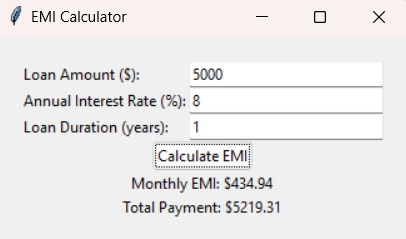
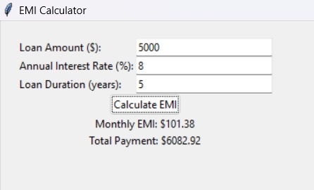
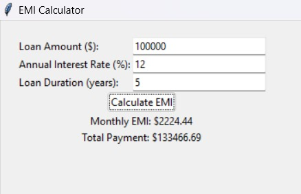

# Introducing the Simple EMI Calculator

Welcome to my project: a straightforward EMI Calculator built with Python and Tkinter. My goal was to create an easy-to-use application that could calculate the monthly loan payments, known as Equated Monthly Installments (EMI), as well as the total amount payable over the life of the loan. Simply enter the loan amount, the interest rate per year, and the duration of the loan in months. This tool is perfect for anyone from financial advisors to individuals planning their finances.

****

## What is Tkinter?
Tkinter is Python's standard library for creating graphical user interfaces (GUIs). It is one of the oldest and most popular Python GUI libraries, and it comes included with Python, which means you don't need to install anything extra to use it. Tkinter provides various controls, such as buttons, labels, and text boxes, which are used to build a user interface. It's a great choice for simple applications like this EMI Calculator because it's relatively straightforward to use and integrates seamlessly with Python.

## What is EMI?

EMI stands for Equated Monthly Installment. It's the fixed payment amount made by a borrower to a lender at a specified date each calendar month. The EMI includes payments towards the loan amount and the interest on it.

****

### Features of the EMI Calculator

This EMI Calculator is designed with simplicity and functionality in mind. Here's what it offers:

- **User-Friendly Interface**: The calculator uses a clean graphical user interface built with Tkinter, making it accessible to users of all levels.
- **Accurate Calculations**: It accurately calculates the EMI based on user-provided data including the loan amount, interest rate, and loan duration.
- **Error Handling**: The calculator is programmed to handle common input errors, ensuring users are aware of any incorrect data entries.

****

### How It Works

The user inputs three key pieces of information:
1. The total loan amount
2. The annual interest rate (in percentage)
3. The duration of the loan in years

Upon entering these details and clicking the 'Calculate EMI' button, the calculator processes the inputs using the standard EMI formula and displays the monthly EMI and the total payment over the loan's lifespan.

****

### Running the Calculator

To try out the calculator:
1. Ensure you have Python and Tkinter installed.
2. Download the script from my GitHub repository.
3. Run the script via a command line tool.

It's as simple as that! 

### Conclusion

Whether you're making financial decisions for your home or for your business, this EMI Calculator is a handy tool to have at your disposal. Give it a try and see just how easy managing your loans can be!

****

#### SCREENSHOTS :

   
   
   
   

****

### Name :
- Deepti
---

